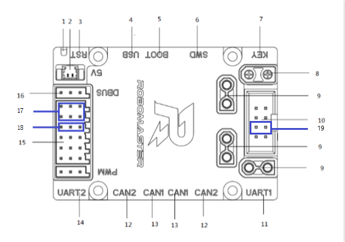
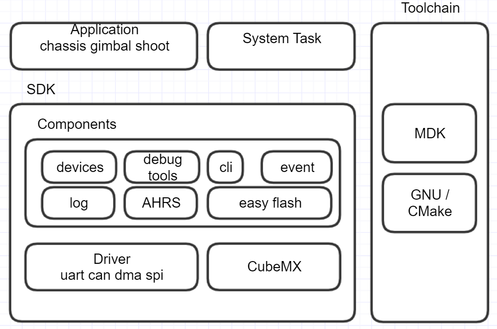

# 河北工业大学RMUL2023 步兵电控

autor：brimonzzy


## 硬件接线图

来自robomaster AI机器人2020标准版：


## 代码解读


### typedef（为复杂的声明定义一个别名）

例如：`int (*pFunc)(char *frame, int len);` 定义了一个函数指针变量pFunc，它可以指向这样的函数：返回值为int，形参为char*、int。`typedef int (*pFunc_t)(char *frame, int len);` 定义了一个类型函数指针pFunc_t。

以代码中`typedef int32_t (*fn_can_send)(enum device_can can, struct can_msg);`为例：`motor_can_send_register`将`motor_can_send`指向函数形参的函数，`motor_can_send`是`fn_can_send`类型的，所以可以直接使用`motor_can_send`来代指设置的函数。这样提高了代码的复用性。


application中的infantry_cmd.h中定义着通信协议


底盘跟随云台：`follow_relative_angle`从`follow_angle_info_rcv()`中获取，数据类型为`struct cmd_gimbal_info`，函数`follow_angle_info_rcv `在`chassis_recv_cmd_table`中指定为`CMD_PUSH_GIMBAL_INFO`消息的回调函数。在`chassis_app_init`中被初始化到`app->recv_cmd_table`，


`chassis_info_push`在`chassis_app_init`注册到软件定时器，10ms执行一次，调用`protocol_send`发布位置、角度、速度数据到pc端

`gimbal_info_push`在`gimbal_app_init`注册到软件定时器，10ms执行一次，调用`protocol_send`发布云台信息到`PROTOCOL_BROADCAST_ADDR`


`protocol_send`

`protocol_s_broadcast_add_node`、`protocol_s_add_sendnode`将要传输的数据打包

`send_list_add_callBack`发送成功后的回调函数


GIMBAL的can地址为0x500，CHASSIS的can地址为0x600

`protocol_can_interface_register`初始化板间can通信，发送的回调函数为`can1_std_transmit`

`can_fifo0_rx_callback_register`函数注册can接收回调函数，在`board_config`被调用，注册can1和can2的接收回调函数为`can1_msg_rec`和`can2_msg_rec`。`can1_msg_rec`调用`protocol_can_rcv_data`和`board_app->can1_msg_callback`函数。`can1_msg_callback`在`gimbal_app_init`中初始化`gimbal_can1_callback`


can中断服务函数在`drv_can.c`中`HAL_CAN_RxFifo0MsgPendingCallback`


云台相关的角度限幅在`gimbal.h`中


## 文件结构

```txt
.
├── README.md
├── application
|   ├── chassis
|   └── gimbal
├── bsp
|	├── boards
|   └── cubemx					// cubemx生成的bsp文件
|		├── Core
|		├── Drivers
|		├── MDK-ARM
|		├── Middlewares
|		├── USB_DEVICE
|		└── project.ioc
├── build
|	└── MDK-ARM
├── components					// 通用模块，包括命令行，驱动模块和系统组件
|	├── algorithms				// 算法类
|	├── bmi088
|	├── cli
|	├── devices
|	├── easyflash
|	├── event_mgr
|	├── log
|	├── modules
|	├── protocol
|	├── referee
|	├── soft_timer
|	├── support
|	└── systemview				// 虚拟分析嵌入式系统的工具包(SEGGER SystemView)
├── doc
|	├── image
|	├── ch
|	└── en
├── MDK-ARM
|	└── project.uvprojx
└── tools
```


## Keil工程结构

```
.
├── application
|   ├── init.c					// 任务、系统设置、外设初始化函数
|   ├── app_manage.c			// ?
|   ├── communicate.c			// 通信任务(协议发送和解包任务)
|   ├── offline_service.c		// ?
|   ├── sensor_task.c			// 传感器更新任务(AHRS以及EventMsgPos)
|   ├── shell.c					// 命令行(cli)任务
|   ├── event.h
|   ├── infantry_cmd.h			// 定义了命令的形式
|   └── appcfg.h
├── chassis_app
|   ├── chassis_app.c			// 
|   ├── chassis_task.c			// 底盘控制任务
|   └── chassis_cmd.c			// 底盘命令响应
├── gimbal_app
|   ├── gimbal_app.c			// 
|   ├── gimbal_task.c			// 云台控制任务
|   ├── gimbal_cmd.c			// 云台命令响应
|   └── shoot_task.c			// 发射任务
├── boards
|   ├── board.c					// 开发板外设初始化
|   ├── stm32f4xx_it.c
|   ├── drv_can.c
|   ├── drv_uart.c				// uart1用于shell uart6用于裁判系统
|   ├── drv_dr16.c				// uart3用于遥控器dbus收据接收
|   ├── drv_flash.c
|   ├── drv_io.c
|   ├── drv_bmi088.c
|   └── usbd_cdc_if.c
├── bmi088
|   ├── AHRS_middleware.c		// 姿态解算中间层，为姿态解算提供相关函数
|   ├── BMI088driver.c			// BMI088驱动，提供了初始化和读取BMI088的接口
|   ├── BMI088Middleware.c		// BMI088驱动的中间层，对接HAL库为BMI088driver.c提供相关函数
|   ├── user_lib.c				// 实现一些用户定义的功能函数
|   ├── AHRS.lib				// 姿态解算库
|   └── arm_cortexM4lf_math.lib
├── device
|   ├── device.c				// ?
|   ├── motor.c					// 电机设备接口
|   ├── dbus.c					// dbus设备接口
|   ├── single_gyro.c			// gyro设备
├── ez_flash					// EasyFlash库
├── cli
|   ├── cli_history.c			// 管理命令行输入的历史记录
|   ├── cli_interpreter.c
|   └── cli_process.c			// 处理命令字符和键盘交互，外部只需调用cli_process即可
├── event_mgr					// 事件分发模块采用订阅发布模型，是观察者模式实现，用于数据解耦和传感器数据分发
|   ├── event_mgr.c
|   └── memory_mgr.c
├── log							// 日志打印模块
|   ├── log.c
|   ├── log.h
|   └── log_config.h
├── systemview
├── referee						// 裁判系统相关函数
|   ├── referee_system.c
|   └── referee_system.h
├── modules
|   ├── chassis.c				// 底盘控制相关函数
|   ├── gimbal.c				// 云台控制相关函数
|   └── shoot.c					// 发射控制相关函数
├── algorithm
|   ├── mecanum.c				// 麦克纳姆轮运动学解算
|   ├── pid.c					// PID算法实现
|   └── ramp.c					// 斜坡滤波器实现
├── soft_timer					// 软件定时器
|   ├── soft_timer.c
|   ├── os_timer.c
|   └── period.c
├── protocol					// 协议相关函数
|   ├── protocol.c
|   ├── protocol_common.c
|   ├── protocol_transmit.c
|   └── protocol_interface.c
├── support
|   ├── fifo.c					// FIFO实现
|   ├── mf_crc.c				// CRC校验实现
|   ├── linux_list.h			// 列表实现
|   └── mem_mang4.c				// freertos内存管理
├── freertos
├── cubemx
├── usb_device
└── stm32f4xx_hal 
```


## TODO


- [ ] 
- [ ] 


## 概述

- en doc   [readme](doc/en/readme.md)

### 软件环境

 - Toolchain/IDE : MDK-ARM V5 / arm-none-eabi
 - package version: STM32Cube FW_F4 V1.24.0
 - FreeRTOS version: 10.0.0
 - CMSIS-RTOS version: 1.02

### 编程规范

- 变量和函数命名方式遵循 Unix/Linux 风格
- chassis\_task与gimbal\_task是强实时控制任务，优先级最高，禁止被其他任务抢占或者阻塞
- 不需要精确计时的任务，采用自行实现的软件定时器实现，定时精度受任务调度影响

### 注意事项

1.由于发射机构触动开关阻力非常小，轻微转动拨弹电机就可能造成子弹越过触动开关触碰摩擦轮，导致摩擦轮摩擦过大无法启动，**造成摩擦轮磨损和电机启动失败**。因此，开电前务必检查是否有子弹已经越过触动开关。**取出办法**：用手按住一侧摩擦轮，旋转另一个摩擦轮。

2.由于snail电机初始化未成功时，电机产生叫声的频率在角速度响应范围内，会极大的干扰云台控制，导致无法正常控制。**解决方法**：可以对陀螺仪数据采用**带阻滤波**解决。（本版本未加入）

3.在云台控制逻辑中，考虑到调试视觉识别装甲时可能需要发射子弹功能，所以自动模式下开放了单发功能。但如果在单发后没有将左拨杆回中，会导致在从自动模式下切回手动模式立刻触发连发模式。因此，**在自动模式下单发之后务必保证将拨杆拨回中间位置。**

4.国际开发板C型上有一枚跳线帽，用于区分当前为底盘模块还是云台模块，插上跳线帽为底盘模块。出现不能控制且无声光报警请检查跳线帽是否松动，

### 兼容2019年车体结构
打开 appcfg.h 文件的宏 ICRA2019 可以使用2019年车体结构参数，包括轮距轴距，云台轴向等。

### 云台校准方法

国际开发板C型自带用户按键，短按可以进行陀螺仪校准。云台模块完成陀螺仪校准后，还会利用机械限位进行云台角度校准

触发条件：

1.开发板首次刷入程序或者参数区被清空

2.按下板载白色按键触发

注意：校准时务必将底盘放在水平地面，保证车体静止

### 模块离线说明

当车辆的某个模块离线时，可以根据声光指示进行问题定位

蜂鸣器鸣叫次数按照离线模块的优先级进行错误指示，例如云台电机优先级高于拨弹电机，如果同时发生离线，先指示当前离线设备是云台电机

注意：有且仅有在遥控器右上摇杆拨到下方，同时底盘C型板接入到机载电脑并运行相关驱动后，才能屏蔽电机模块离线功能

模块离线对应的状态如下，数字对应蜂鸣器每次鸣叫的次数，按照优先级排序：

#### 底盘模块

1. 右前轮电机掉线
2. 左前轮电机掉线
3. 左后轮电机掉线
4. 右后轮电机掉线

#### 云台模块

5. 云台 YAW 电机掉线
6. 云台 PITCH 电机掉线
7. 拨盘电机掉线

#### 遥控器离线

此时红灯常亮，所有执行器失效

#### 妙算心跳离线

当右上角拨杆开关打下时，若没有收到妙算心跳，此时蓝灯常亮

### 文档

- 协议文档  [protocol](doc/ch/protocol.md)
- protocol [document](doc/en/protocol.md)

## 快速开始

### 硬件接口

主控板使用国际开发板 C 型，各个功能接口的位置如下：



**云台接口**
17: pwm pin
18: trigger pin

**底盘接口**
19: firmware config pin.

### 功能模块

#### 手动模式：

提供遥控器基础控制。

#### 全自动模式：

这种模式下底盘、云台、发射机构受到上层 PC 的完全控制，完全控制包含对这些执行机构以具体物理单位的控制。

#### 操作档位说明：

##### 手动档

遥控器控制（底盘跟随云台）：右拨杆上
遥控器控制（云台跟随地盘）：右拨杆中

- 开、关摩擦轮（左拨杆上拨）
- 单发、连发射击（左拨杆下拨）

##### 自动档

正常比赛时使用（拨杆右下）

左拨杆位置对应功能：

- 上：摩擦轮打开，其他全接管
- 中：摩擦轮关闭，其他全接管
- 下：只具有单发功能

## 程序说明

### 程序体系结构

#### 体系框架

1. 使用免费及开源的 freertos 操作系统，兼容其他开源协议 license；
2. 使用标准 CMSIS-RTOS 接口，方便不同操作系统或平台间程序移植；
3. 提供一套抽象步兵机器人bsp，简化上层逻辑；

**application**：上层应用任务，包括系统任务

**bsp**：C型开发板适配包

**components**：通用机器人模块，包括命令行，驱动模块和系统组件

**doc**：说明文档

**MDK-ARM**：armcc工具链，注意：未购买license最多只能编译20kb大小固件

**tools**: cmake gnu toolchain. You should install make, cmake, arm-none-eabi and set env value.

### 软件体系

固件提供统一的机器人软件栈，所有业务逻辑包含在application中，使用观察者模式分发信息，软件框架如下：



### 硬件体系

1. 主控 MCU：STM32F407IGHx，配置运行频率180MHz
2. 模块通信方式：CAN；CAN设备：电机电调、陀螺仪模块
3. 上下层通信方式：USB虚拟串口
4. 麦轮安装方式：O型

### 协议数据

#### 数据分类

协议数据按照通信方向可以分为两大类：

底层发送给上层的数据：

1. 反馈信息：包含各个机构传感器反馈信息、底层计算出来的一些反馈信息；
2. 底层状态信息：包含底层设备运行状态、底层对上层数据的一些响应等；
3. 转发数据：包含裁判系统的全部信息、服务器端的自定义信息；

底层接收的上层数据：

1. 控制信息：上层对底层 3 个执行机构的控制信息；

